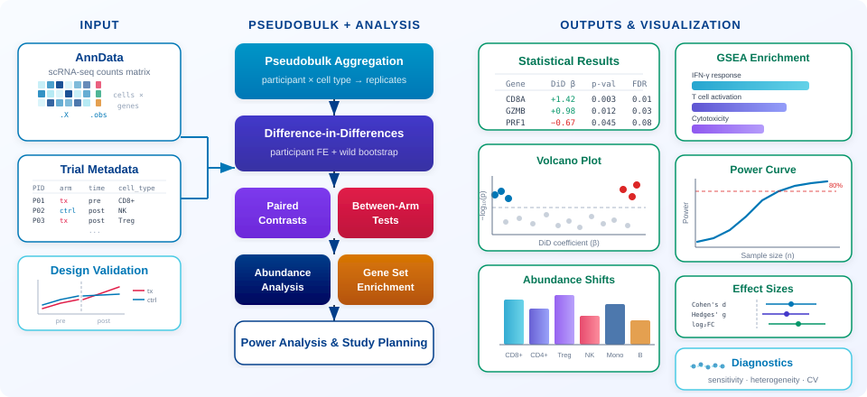

<p align="center">
  
</p>
<p align="center"><strong>Trial-Aware Statistical Inference for Single-Cell Data</strong></p>

<p align="center">
  <a href="https://github.com/TheOmarLab/sctrial/actions/workflows/test.yml">
    
  </a>
  <a href="https://github.com/TheOmarLab/sctrial/releases">
    
  </a>
  
  <a href="https://opensource.org/licenses/MIT">
    
  </a>
  <a href="https://TheOmarLab.github.io/sctrial/">
    
  </a>
</p>

<p align="center">
  
</p>

---

## Overview

**sctrial** is a Python package for performing rigorous statistical inference on single-cell RNA-seq data from clinical trials and longitudinal studies. Built on top of [AnnData](https://anndata.readthedocs.io/) and [Scanpy](https://scanpy.readthedocs.io/), it provides specialized tools for:

- **Difference-in-Differences (DiD)** analysis with participant fixed effects
- **Paired within-arm** pre→post contrasts
- **Between-arm** comparisons at fixed timepoints
- **Cell-type abundance** change testing
- **Gene set enrichment** analysis (GSEA) on DiD rankings
- **Power analysis** and sample size calculations
- **Effect size** estimation with confidence intervals

## Key Features

| Feature | Description |
|---------|-------------|
| **Trial-Aware Design** | Define participant, visit, arm, and cell type columns once |
| **Robust Statistics** | Wild cluster bootstrap, participant-level aggregation |
| **Multiple Comparisons** | Built-in FDR correction across features and cell types |
| **Power Analysis** | Plan studies with power curves and sample size calculations |
| **Publication-Ready Plots** | Forest plots, interaction plots, GSEA heatmaps |
| **Scalable** | Efficient processing of large single-cell datasets |

## Installation

```bash
pip install sctrial
```

For development:
```bash
git clone https://github.com/TheOmarLab/sctrial.git
cd sctrial
pip install -e ".[dev]"
```

## Quick Start

```python
import sctrial as st

# Define trial design
design = st.TrialDesign(
    participant_col="participant_id",
    visit_col="visit",
    arm_col="arm",
    arm_treated="Treated",
    arm_control="Control",
    celltype_col="celltype",
)

# Preprocess and score
adata = st.add_log1p_cpm_layer(adata, counts_layer="counts")
adata = st.score_gene_sets(adata, gene_sets, layer="log1p_cpm", method="zmean")

# Run Difference-in-Differences analysis
results = st.did_table(adata, features, design, visits=("Baseline", "Week12"))
```

## Tutorials

| Notebook | Dataset | Analysis Type |
|----------|---------|---------------|
| [COVID-19 Immune Profiling](tutorials/example_covid19_stephenson.ipynb) | Stephenson et al., Nature 2021 | Cross-sectional severity comparison |
| [Immunotherapy Response](tutorials/example_immunotherapy_sade_feldman.ipynb) | Sade-Feldman et al., Cell 2018 | Longitudinal DiD with response groups |
| [Vaccine Response](tutorials/example_vaccine_immport.ipynb) | ImmPort GSE171964 | Within-arm paired analysis |
| [Scalability Benchmark](tutorials/stress_test_real_scale.ipynb) | Sade-Feldman et al. | Performance and scalability testing |

## Documentation

Full documentation: [https://TheOmarLab.github.io/sctrial/](https://TheOmarLab.github.io/sctrial/)

- [API Reference](https://TheOmarLab.github.io/sctrial/api.html)
- [Tutorials](https://TheOmarLab.github.io/sctrial/tutorials/index.html)
- [FAQ](https://TheOmarLab.github.io/sctrial/faq.html)

## Citation

If you use **sctrial** in your research, please cite:

```bibtex
@software{omar2024sctrial,
  author = {Omar, Mohamed},
  title = {sctrial: Trial-Aware Statistical Inference for Single-Cell Data},
  year = {2024},
  publisher = {GitHub},
  url = {https://github.com/TheOmarLab/sctrial}
}
```

## License

MIT License - see [LICENSE](LICENSE) for details.
