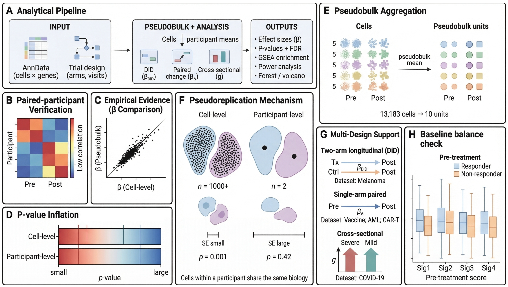

<p align="center">
  
</p>
<p align="center"><strong>Trial-Aware Statistical Inference for Single-Cell Data</strong></p>

<p align="center">
  <a href="https://github.com/TheOmarLab/sctrial/actions/workflows/test.yml">
    
  </a>
  <a href="https://github.com/TheOmarLab/sctrial/releases">
    
  </a>
  
  <a href="https://opensource.org/licenses/MIT">
    
  </a>
  <a href="https://TheOmarLab.github.io/sctrial/">
    
  </a>
</p>

---

## Overview

<p align="center">
  
</p>

**sctrial** is a Python package for performing rigorous statistical inference on single-cell RNA-seq data from clinical trials and longitudinal studies. Built on top of [AnnData](https://anndata.readthedocs.io/) and [Scanpy](https://scanpy.readthedocs.io/), it provides specialized tools for:

- **Difference-in-Differences (DiD)** analysis with participant fixed effects
- **Paired within-arm** pre→post contrasts
- **Between-arm** comparisons at fixed timepoints
- **Cell-type abundance** change testing
- **Gene set enrichment** analysis (GSEA) on DiD rankings
- **Power analysis** and sample size calculations
- **Effect size** estimation with confidence intervals

## Key Features

| Feature | Description |
|---------|-------------|
| **Trial-Aware Design** | Define participant, visit, arm, and cell type columns once |
| **Robust Statistics** | Wild cluster bootstrap, participant-level aggregation |
| **Multiple Comparisons** | Built-in FDR correction across features and cell types |
| **Power Analysis** | Two-arm DiD and single-arm paired power/sample size calculations |
| **Single-Arm Support** | `arm_col=None` for studies without a control arm |
| **Publication-Ready Plots** | Forest plots, interaction plots, GSEA heatmaps |
| **Scalable** | Efficient processing of large single-cell datasets |

## Installation

```bash
pip install sctrial
```

For development:
```bash
git clone https://github.com/TheOmarLab/sctrial.git
cd sctrial
pip install -e ".[dev]"
```

## Quick Start

```bash
pip install "sctrial[plots]"   # includes dataset loaders and visualization
```

```python
import sctrial as st

# 1. Load a real immunotherapy trial dataset (auto-downloads on first use)
adata = st.load_sade_feldman()
adata = st.harmonize_response(adata)  # majority-vote response labels

# 2. Define trial design
design = st.TrialDesign(
    participant_col="participant_id",
    visit_col="visit",
    arm_col="response_harmonized",
    arm_treated="Responder",
    arm_control="Non-responder",
    celltype_col="cell_type",
)

# 3. Score gene sets (dataset ships pre-normalized with log1p_tpm layer)
gene_sets = {
    "Cytotoxicity": ["GZMA", "GZMB", "PRF1", "GNLY", "NKG7"],
    "Exhaustion":   ["PDCD1", "CTLA4", "HAVCR2", "LAG3", "TIGIT"],
}
adata = st.score_gene_sets(adata, gene_sets, layer="log1p_tpm", method="zmean", prefix="ms_")

# 4. Run Difference-in-Differences on CD8 T cells
features = [c for c in adata.obs.columns if c.startswith("ms_")]
results = st.did_table(adata, features, design, visits=("Pre", "Post"), celltype="CD8 T cell")
print(results[["feature", "beta_DiD", "se_DiD", "p_DiD", "FDR_DiD"]])
```

Or use the one-liner convenience wrapper for a quick multi-cell-type scan:

```python
results = st.quick_did(
    adata,
    module_scores=gene_sets,
    visits=("Pre", "Post"),
    arm_col="response_harmonized",
    arm_treated="Responder",
    arm_control="Non-responder",
    celltype_col="cell_type",
)
```

## Supported Study Designs & Datasets

sctrial ships with five real clinical trial datasets, accessible via built-in loaders (`st.load_*()`). Each demonstrates a different study design:

| Design | Description | Dataset | Source | Tutorial |
|--------|-------------|---------|--------|----------|
| **Two-arm paired DiD** | Pre/post × treatment/control interaction | Sade-Feldman et al., *Cell* 2018 — melanoma immunotherapy | [GSE120575](https://www.ncbi.nlm.nih.gov/geo/query/acc.cgi?acc=GSE120575) | [Immunotherapy](tutorials/example_immunotherapy_sade_feldman.ipynb) |
| **Single-arm pre/post** | Paired within-arm contrasts over time | ImmPort GSE171964 — PBMC vaccine response | [GSE171964](https://www.ncbi.nlm.nih.gov/geo/query/acc.cgi?acc=GSE171964) | [Vaccine](tutorials/example_vaccine_immport.ipynb) |
| **Single-arm pre/post** | Paired within-arm, multi-timepoint | van Galen et al., *Cell* 2019 — AML chemotherapy | [GSE116256](https://www.ncbi.nlm.nih.gov/geo/query/acc.cgi?acc=GSE116256) | — |
| **Single-arm multi-timepoint** | Longitudinal tracking across 4 visits | GSE290722 — CAR-T cell therapy (ZUMA-1) | [GSE290722](https://www.ncbi.nlm.nih.gov/geo/query/acc.cgi?acc=GSE290722) | — |
| **Cross-sectional between-arm** | Between-group comparison at one timepoint | Stephenson et al., *Nature Medicine* 2021 — COVID-19 severity | [E-MTAB-10026](https://www.ebi.ac.uk/biostudies/arrayexpress/studies/E-MTAB-10026) | [COVID-19](tutorials/example_covid19_stephenson.ipynb) |

Additional tutorial: [Scalability Benchmark](tutorials/stress_test_real_scale.ipynb) — performance testing on the Sade-Feldman dataset.

## Documentation

Full documentation: [https://TheOmarLab.github.io/sctrial/](https://TheOmarLab.github.io/sctrial/)

- [API Reference](https://TheOmarLab.github.io/sctrial/api.html)
- [Tutorials](https://TheOmarLab.github.io/sctrial/tutorials/index.html)
- [FAQ](https://TheOmarLab.github.io/sctrial/faq.html)

## Citation

If you use **sctrial** in your research, please cite:

```bibtex
@software{omar2024sctrial,
  author = {Omar, Mohamed},
  title = {sctrial: Trial-Aware Statistical Inference for Single-Cell Data},
  year = {2026},
  publisher = {GitHub},
  url = {https://github.com/TheOmarLab/sctrial}
}
```

## License

MIT License - see [LICENSE](LICENSE) for details.
